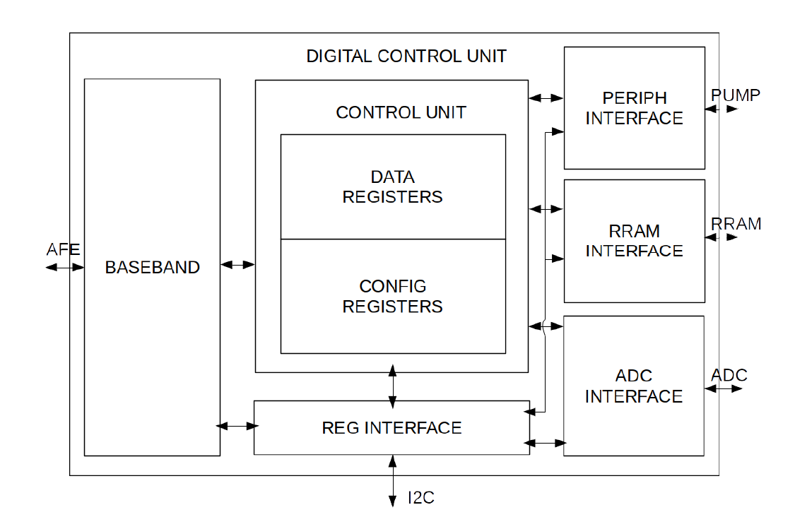
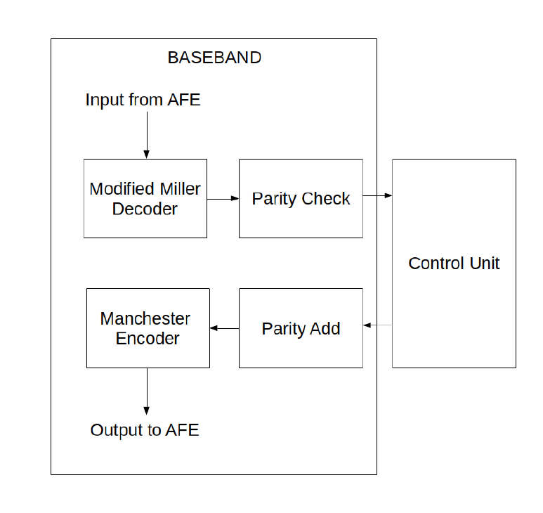
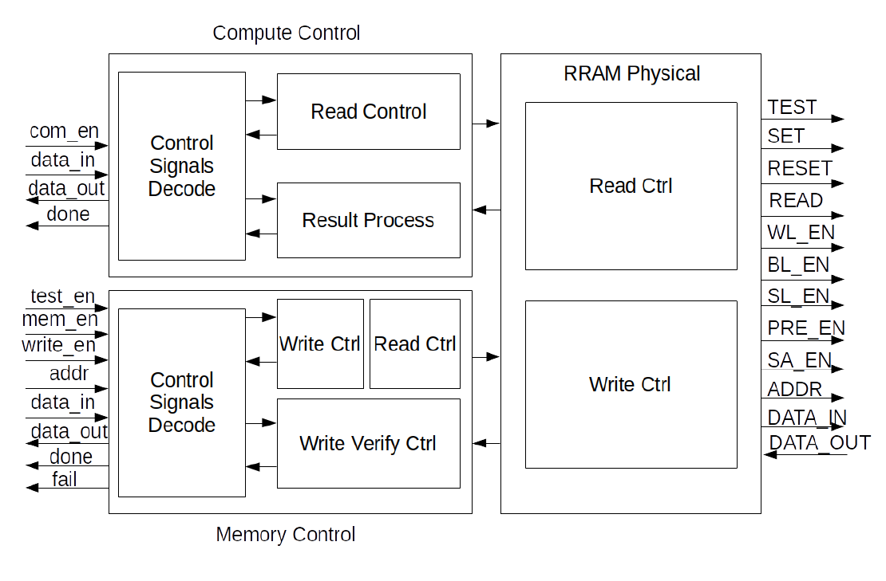
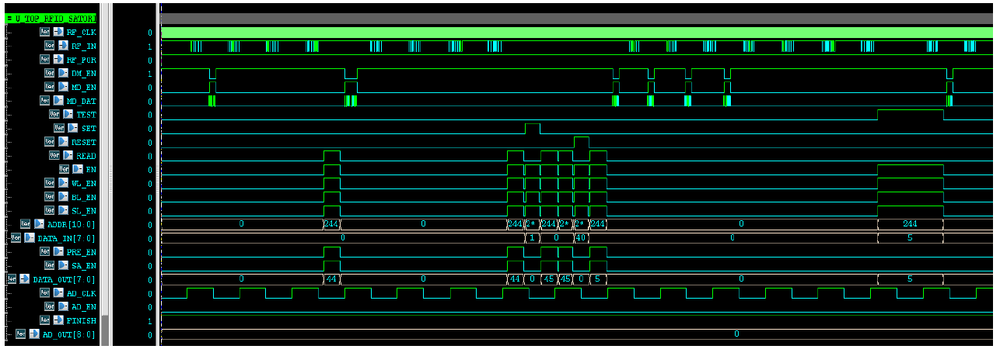

## IME-BIT 数字ASIC前端开发规范 v1.2

编写人：袁易扬

联系方式：2861704773@qq.com

| 文档版本 |  编写日期  |        说明        |
| :------: | :--------: | :----------------: |
|   v1.0   | 2023.05.19 |      初次发布      |
|   v1.1   | 2023.05.20 | 勘误分频器模板说明 |
|   v1.2   | 2023.05.26 |    勘误工具版本    |


### 1. 工具链

编译工具：

Synopsys VCS 2018

仿真工具：

Synopsys Verdi 2018

综合工具：

Synopsys Design Compiler 2018

代码检查工具：

Synopsys Spyglass 2016


虚拟机下载链接：https://mp.weixin.qq.com/s/GpwRTelbjRWgXMhVu5cUSA

工具链安装包下载：https://mp.weixin.qq.com/s/nHSd1UkOcXe8qaaZtPpJTQ


建议无经验新生直接安装虚拟机，有一定的linux系统使用经验的可安装物理机。

Ubuntu20.04上安装完全套工具链，使用正常。[约一个月linux办公环境使用体验 - sasasatori - 博客园 (cnblogs.com)](https://www.cnblogs.com/sasasatori/p/16748484.html)


### 2. 文档规范

原始文档建议使用markdown进行编辑，markdown编写软件推荐使用Typora（可以下载免费版，也可以购买付费版），也可以使用vscode安装markdown插件后作为markdown编辑器使用。


文档格式可参考附录《设计文档模板》，内容需要包括：

1. 模块功能描述（描述模块整体功能）
2. 模块架构描述（包含框图以及子模块功能基本描述）
3. 模块端口（使用表格进行描述，表格中需要包含以下内容：Port 端口名；Width 端口位宽；Direction 端口方向； Function 功能描述）
4. 功能仿真描述（包含仿真结果波形以及仿真内容说明）


此外文档需要注明以下信息：

1. 文档作者
2. 作者联系方式
3. 文档版本
4. 文档编写日期

若文档存在历史版本，需要说明各版本修改信息。


### 3. 编码规范

主要参考华为内部编码标准。以下规范均只涉及可综合设计部分，对于testbench以及第三方ip不应用以下规范。


#### 3.1 设计风格

1. 低电平有效的信号，信号名后缀"_n"
2. 模块名统一使用小写+下划线方式风格，例如"test_module"
3. 模块例化使用u_xx表示，需要多次例化的模块使用序号表示（0、1、2），例如"u_test_0"
4. 使用降序定义向量位宽，最低位为0，例如"wire [3:0] vector"
5. 采用小写字母定义wire，reg和input/output
6. 采用大写字母定义参数，参数名小于20个字母，例如"parameter PARAM = 2'b00"
7. 时钟信号应前缀"clk"，复位信号应前缀"rst"
8. 对于一个时钟上产生分频时钟应后缀分频比例，例如"clk_128"，表示clk信号分频128倍后产生的时钟
9. 代码中不能使用VHDL，Verilog或SystemVerilog的保留字
10. 在进行模块声明时，按照如下顺序定义端口信号：输入、输出，例如：

```verilog
module test(
	input  a,
    input  b,
    output c
);
```

11. 不要书写空的模块，每个模块至少有一个输入和一个输出
12. 时钟事件必须要以边沿触发的形式书写，即"posedge <clk_name>"或"negedge <clk_name>"
13. 异步复位，高电平有效使用"if(<asynch_reset>)"，低电平有效用"if(!<asynch_reset>)"
14. 代码中给出必要的注释
15. 每个文件应包含一个文件头，即

```
//--------------------------------------------------------------------
//  ___  _____ ______   _______       ________  ___  _________   
// |\  \|\   _ \  _   \|\  ___ \     |\   __  \|\  \|\___   ___\ 
// \ \  \ \  \\\__\ \  \ \   __/|    \ \  \|\ /\ \  \|___ \  \_| 
//  \ \  \ \  \\|__| \  \ \  \_|/__   \ \   __  \ \  \   \ \  \  
//   \ \  \ \  \    \ \  \ \  \_|\ \ __\ \  \|\  \ \  \   \ \  \ 
//    \ \__\ \__\    \ \__\ \_______\\__\ \_______\ \__\   \ \__\
//     \|__|\|__|     \|__|\|_______\|__|\|_______|\|__|    \|__|                         
//
// COPYRIGHT 2023, ALL RIGHTS RESERVED
// Institute of Microelectronics, Chinese Academy of Sciences
// Beijing Institude of Technology
//
// Filename:    
// Author:      
// Date:        
// 
// Project:     
// Description: 
//--------------------------------------------------------------------
```

11. 每个文件只包含一个模块
12. 模块名与模块名保持一致，例如模块命名为"module test"，则文件名必须为"test.v"
13. 模块名或变量要使用缩写时请参考缩写规范：[(382条消息) 【精】Verilog语言缩写规范_verilog 常用缩写_heartdreamplus的博客-CSDN博客](https://blog.csdn.net/heartdreamplus/article/details/86171272)


#### 3.2 设计可靠性

1. 同步时序逻辑的always block中有且只有一个时钟信号，并且所有在同一个边沿动作（如上升沿）
2. 采用同步设计，避免使用异步逻辑（全局异步复位除外） 
3. 避免将时钟信号作为数据信号输入
4. 不要在时钟路径上添加任何buffer（即让原始的时钟信号穿过任何逻辑再输出到其他模块作为时钟）
5. 不要在复位路径上添加任何buffer（即让原始的复位信号穿过任何逻辑再输出到其他模块作为复位）
6. 在顶层模块中，时钟信号必须可见
7. 不要采用向量的方式定义一组时钟
8. 建议使用单一的全局同步复位电路或者单一的全局异步复位电路
9. 不使用不可综合的语法
10. 不使用不可综合的运算符
11. 避免使用inout端口
12. 避免在多个逻辑块中驱动同一个信号
13. 时序always块禁止使用电平驱动
14. 数据位宽要匹配
15. 时序逻辑块统一使用非阻塞赋值（<=）
16. 组合逻辑块统一使用阻塞赋值（=）
17. 避免产生latch
18. 避免产生异步数据环路


#### 3.3 其他规则

基本模板：

强调：所有文件使用UTF-8格式进行编码！

为了便于markdown表格与verilog的自动转换，模块端口声明请采用方向声明与类型声明分离的写法，为了简洁，input端口不声明端口类型，缺省为wire。output端口单独进行reg类型的声明。

[优化数字前端工作流的小脚本 - sasasatori - 博客园 (cnblogs.com)](https://www.cnblogs.com/sasasatori/p/17348866.html)

积极使用参数化设计以提高模块的重用性。

在模块内部进行声明时按照模块端口->参数->内部信号的顺序进行声明。

例子：

```verilog
module my_module #
(
    DATA_WIDTH = 32,
    ADDR_WIDTH = 5
)
(
  input clk, // 时钟  
  input rst_n, // 复位  
  input [ADDR_WIDTH-1:0] inst_addr,  // 指令地址 
  output [DATA_WIDTH-1:0] inst_dout // 指令数据  
);

reg [DATA_WIDTH-1:0] inst_dout;

// 参数
parameter DEPTH = 32;
    
// 内部信号
reg [DATA_WIDTH-1:0] sram [DEPTH-1:0];
    
// 逻辑块    
always @ (posedge clk or negedge rst_n) begin
   ...    
end

// assign语句
assign ... 
    
endmodule
```

以下常用模块参照模板格式进行编码：

1. FSM模板

使用三段式状态机，输出逻辑使用时序逻辑

```verilog
module fsm(
    input clk,
    input rst_n,
    input [1:0] in,
    output [1:0] out
);

reg [1:0] out;

parameter IDLE = 2'b00;
parameter STATE1 = 2'b01;
parameter STATE2 = 2'b10;

reg [1:0] current_state, next_state;

always @ (posedge clk or negedge rst_n) begin
    if(!rst_n) begin
        current_state <= IDLE;
    end else begin
        current_state <= next_state;
    end
end

always @ (*) begin
    case(current_state)
        IDLE: begin
            if(in == 2'b01) begin
                next_state = STATE1;
            end else begin
                next_state = IDLE;
            end
        end

        STATE1: begin
            if(in == 2'b10) begin
                next_state = STATE2;
            end else begin
                next_state = STATE1;
            end
        end

        STATE2: begin
            if(in == 2'b01) begin
                next_state = IDLE;
            end else begin
                next_state = STATE2;
            end
        end

        default: next_state = IDLE;
    endcase
end

always @ (posedge clk or negedge rst_n) begin
    if(!rst_n) begin
        out <= 2'b00;
    end else begin
        case(current_state)
            IDLE: out <= 2'b00;
            STATE1: out <= 2'b01;
            STATE2: out <= 2'b10;
            default: out <= 2'b00;
        endcase
    end
end

endmodule
```

2. regfile

写端口使用时序逻辑，读端口使用组合逻辑，采用参数化设计以便控制位宽

```verilog
module regfile #(
    parameter ADDR_WIDTH = 5,
    parameter DATA_WIDTH = 32,
    parameter DEPTH = 32
) (
    input clk,
    input rst_n,
    input wren,
    input [ADDR_WIDTH-1:0] raddr1,
    input [ADDR_WIDTH-1:0] raddr2,
    input [ADDR_WIDTH-1:0] waddr,
    input [DATA_WIDTH-1:0] wdata,
    output [DATA_WIDTH-1:0] rdata1,
    output [DATA_WIDTH-1:0] rdata2
);

output reg [DATA_WIDTH-1:0] rdata1;
output reg [DATA_WIDTH-1:0] rdata2;

reg [DATA_WIDTH-1:0] regs [DEPTH-1:0];

always @ (posedge clk or negedge rst_n) begin
    if(!rst_n) begin
        for(int i=0; i<DEPTH; i=i+1) begin
            regs[i] <= 0;
        end
    end else if(wren) begin
        regs[waddr] <= wdata;
    end
end

assign rdata1 = regs[raddr1];
assign rdata2 = regs[raddr2];

endmodule
```

3. 译码逻辑

针对简单的译码逻辑可以使用case语句进行生成

```verilog
module decoder(
    input [1:0] in,
    output [3:0] out
);

reg [3:0] out;    

always @ (*) begin
    case(in)
        2'b00: out = 4'b0001;
        2'b01: out = 4'b0010;
        2'b10: out = 4'b0100;
        2'b11: out = 4'b1000;
    endcase
end

endmodule
```

针对复杂译码逻辑（如cpu的指令译码）为了避免综合时产生latch，强烈建议使用wire和assign的纯组合语法，例如：

```verilog
module decoder(
    input [1:0] in,
    output[3:0] out
);

assign out[0] = (in == 2'b00) ? 1'b1 : 1'b0;
assign out[1] = (in == 2'b01) ? 1'b1 : 1'b0;
assign out[2] = (in == 2'b10) ? 1'b1 : 1'b0;
assign out[3] = (in == 2'b11) ? 1'b1 : 1'b0;

endmodule
```

4. 分频逻辑

采用参数化设计

```verilog
module clk_divider
#(
    parameter DIV = 10
)
(
    input clk,
    input rst_n,
    output out
);

reg out;
    
reg [7:0] cnt;

always @(posedge clk or negedge rst_n) begin
    if (!rst_n) begin
        cnt <= 0;
        out <= 0;
    end else if (cnt == DIV - 1) begin
        cnt <= 0;
        out <= ~out;
    end else begin
        cnt <= cnt + 1;
    end
end

endmodule
```


### 4. 基本工程结构

所有路径描述务必均使用相对路径，避免出现任何工程文件夹外的路径。

示例工程结构：

```she
.
|-- doc
|   `-- xxx.pdf
|-- lib
|   `-- xxx
|-- output
|   |-- netlist
|   `-- gds
|-- prj
|   `-- makefile
|-- src
|   |-- rtl
|   `-- sdc
|-- tb
|   |-- data
|   `-- tb_xxx.v
`-- work
    |-- dc
    |-- spyglass
    |-- vcs
    `-- verdi
```


### 5. 推荐阅读资料

[verilog注意事项](https://blog.eetop.cn/blog-239461-23763.html)

[Verilog中可综合与不可综合的语句 - 知乎 (zhihu.com)](https://zhuanlan.zhihu.com/p/146034068)

[综合工具-DesignCompiler学习教程 - 知乎 (zhihu.com)](https://zhuanlan.zhihu.com/p/452563769)

[使用 Design Compiler 评估 RTL 设计 - 知乎 (zhihu.com)](https://zhuanlan.zhihu.com/p/401603501)

[DC report_timing 报告分析（STA）_北方爷们的博客-CSDN博客](https://blog.csdn.net/sinat_29862967/article/details/111225986#:~:text=Design,Compiler中，常用report_timing命令来报告设计的时序是否满足目标（Check_timing%3A检查约束是不是完整的，在综合之前查看，要注意不要与这个混淆）。)


### 6. 附录：设计文档模板


## 文档标题（请使用二级标题）

编写人：xxx

联系方式：xxx（建议填写常用邮箱）

| 文档版本 |  编写日期  | 说明 |
| :------: | :--------: | :--: |
|   v1.0   | YYYY.MM.DD | xxxx |
|   v1.1   | YYYY.MM.DD | xxxx |
|  ......  |            |      |


### 1. 模块功能

1. 连接基带，RRAM，ADC等存储模块，进行整体调度。
2. 可接收来自基带的指令，可完成读取ADC，读写存储器等功能。
3. 可通过I2C输入指令完成与基带相同的指令控制，同时可以直接访问模块内部的寄存器。
4. ......


### 2. 模块架构



顶层模块digtial_control_unit共包含以下子模块：


#### 2.1 baseband
基带模块，连接AFE，进行基带信号的编解码。
基带的整体架构如下图所示：



共分为modified miller decoder，parity check，manchester encoder，parity add四个子模块。采用 modified miller编码作为输入，manchester编码作为输入，parity check用于鉴别帧类型以及检查校验位。parity add用于计算输出帧的校验位。


#### 2.2 rram_interface

存储控制模块，连接RRAM CIM模块，已经完成实现对存储器的读写控制。写入采用write verify算法。模块计算采用类似于Shimeng Yu的XNOR RRAM结构，采用数字存算原理，仅需通过访存和加法器即可完成运算，相比老版本电路节省大量同或门。



#### 2.3 ....


### 3. 模块端口

#### 3.1 digtal_control_unit（顶层模块接口）

| Port   | Width | Direction | Function                    |
| ------ | ----- | --------- | --------------------------- |
| RF_CLK | 1     | input     | AFE射频时钟                 |
| RF_IN  | 1     | input     | AFE射频解调器输出的基带信号 |
| ADDR   | 11    | output    | CIM地址端口                 |
| ...... |       |           |                             |


#### 3.2 BASEBAND（一级子模块接口）

| Port   | Width | Direction | Function                    |
| ------ | ----- | --------- | --------------------------- |
| RF_CLK | 1     | input     | AFE射频时钟                 |
| RF_IN  | 1     | input     | AFE射频解调器输出的基带信号 |
| ...... |       |           |                             |


#### 3.3 ...


### 4. 功能仿真

基带测试序列依次为：
REQA（激活模块），READ（读取存储器0x244地址数据），WRITE（向存储器0x244地址写入0x05），HLAT（模块休眠），WAKEUP（模块唤醒），FAIL（错误数据测试），TEST（模块测试模式），ADEN（ADC采样模式），CALC（计算功能）



(仿真波形图+文字解释)
